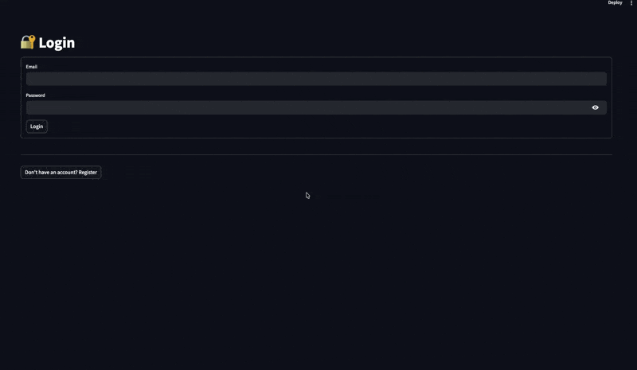

# 🎓 Practical Exam: Modernizing an Analytical Agent Platform

**Course**: AI-Agents-MLOps-Course

**Total Points**: 20 points


## 🔴 Problem: Why This Architecture Fails in Production

The `AgenticDataAnalysis` application you see here is a **first functional iteration**, but it suffers from critical limitations that make it **unusable in production**. Your task is to transform it into a **scalable, secure, and persistent platform**.

### 1. 🧠 Memory Loss on Restart (CRITICAL)
```
Symptom: Every time the app restarts, the entire conversation history disappears
Cause: No persistence of agent states
Impact: Learning impossible, users must start from scratch
Example: 
  - User 1 asks "Analyze average revenue" → Agent responds
  - App restarts
  - User 1 asks a follow-up question → Agent remembers nothing
```

**Course Solution (Chapter 4)**  
Implement a **PostgreSQL checkpointer with LangGraph** that persists the agent's full state in the database.

### 2. 👥 No Multi-User Support (CRITICAL)
```
Symptom: No authentication, all data is shared
Cause: Streamlit monolithic architecture
Impact: Major security risk and privacy violation
Example:
  - User A uploads their personal dataset → User B sees it too
  - No data isolation
  - No GDPR/HIPAA compliance
```

**Course Solution**  
- JWT authentication with FastAPI
- User model with SQLAlchemy
- Isolation by `user_id` everywhere

### 3. 💾 Complete Result Volatility (SEVERE)
```
Symptom: All visualizations and analyses are lost on restart
Cause: No database
Impact: No traceability, no regulatory compliance
Example:
  - User exports a report → Server crashes
  - Report is lost, user must redo everything
```

**Course Solution**  
- PostgreSQL to store visualizations
- Plotly JSON format for reliable persistence

### 4. 📈 Lack of Scalability (SEVERE)
```
Symptom: Single Streamlit process, unable to handle multiple requests
Cause: Monolithic architecture
Impact: Collapse under load, downtime
Example:
  - 2 users make simultaneous requests → App freezes
  - A long-running request blocks all others
  - Impossible to add workers
```

**Course Solution (Chapter 5)**  
- FastAPI backend (stateless, scalable)
- Celery queue for asynchronous processing
- Microservices architecture

### 5. 🔐 Unsecured Code Execution (CRITICAL)
```
Symptom: Python code executed directly without validation
Cause: exec() or eval() without sandbox
Impact: Code injection, data theft, sabotage
Example:
  - Attacker submits: "__import__('os').system('rm -rf /')"
  - Code executed directly → Data loss
```

**Course Solution**  
- RestrictedPython for secure execution
- Resource limits (timeouts, RAM)
- Whitelist of approved modules


## 📋 Implementation Phases

Here is the target Streamlit application that we expect to have after the exam:



### ✅ Phase 1: Analysis and Design (2 points)
**Objective**: Understand the problem and propose a solution

- [ ] Analyze the existing application
- [ ] Document the 5 limitations in `docs/ARCHITECTURE_ANALYSIS.md`
- [ ] Propose a target architecture
- [ ] Create a UML/C4 diagram of the modern architecture

**File to create**: `docs/ARCHITECTURE_ANALYSIS.md`


### 🔧 Phase 2: Production-Ready Backend (6 points)
**Objective**: Build the foundations for scalability

**2.1 FastAPI API**
- [ ] Create `backend/api/main.py` with FastAPI
- [ ] Add CORS middleware
- [ ] Implement global error handling
- [ ] Setup structured logging

**2.2 Authentication & Users**
- [ ] `User` model with SQLAlchemy
- [ ] `/api/auth/register` and `/api/auth/login` routes
- [ ] JWT tokens with expiration
- [ ] Route protection with `get_current_user`

**2.3 Data Models**
- [ ] `User`: email, hashed password, timestamps
- [ ] `Dataset`: owner (FK User), metadata
- [ ] `AnalysisSession`: user_id, status, messages
- [ ] `Visualization`: session_id, figure_json

**2.4 LangGraph Agent Migration**
- [ ] Create `backend/agents/agent_manager.py`
- [ ] **IMPORTANT**: Implement PostgreSQL checkpointer (Chapter 4)
- [ ] Manage sessions with thread_id = session_id

**2.5 Security: Code Sandbox**
- [ ] Create `backend/security/code_sandbox.py`
- [ ] Implement RestrictedPython
- [ ] Timeouts with signal/threading
- [ ] Module whitelist (pandas, numpy, sklearn)

**2.6 Celery & Async**
- [ ] Celery configuration with Redis
- [ ] Task for analysis processing
- [ ] Queue separation (analysis, datasets)


### 💾 Phase 3: Robust Persistence (4 points)
**Objective**: Ensure nothing is ever lost

- [ ] PostgreSQL with Alembic migrations
- [ ] **LangGraph checkpointer in PostgreSQL database** (Chapter 4 of the course)
- [ ] Persistent user sessions
- [ ] Visualizations stored in JSON
- [ ] Analysis history with timestamps

**Important**: This is where we solve problem #1 (memory loss)


### 🎨 Phase 4: Frontend and Integration (4 points)
**Objective**: Modernize the interface without reinventing the wheel

- [ ] Refactor Streamlit to call the backend
- [ ] API client with session management
- [ ] Login/register in the UI
- [ ] Display analysis history
- [ ] Overall UX improvement


### 🚀 Phase 5: Deployment and Testing (4 points)
**Objective**: Ensure everything actually works

**5.1 Dockerization**
- [ ] `Dockerfile.backend` for FastAPI
- [ ] `Dockerfile.frontend` for Streamlit
- [ ] `Dockerfile.celery` for worker
- [ ] Complete `docker-compose.yml`

**5.2 Functional Tests (MANDATORY)**
- [ ] `backend/tests/test_agent_integration.py`: Agent tests
- [ ] `backend/tests/test_api.py`: API tests
- [ ] `backend/tests/test_persistence.py`: Persistence tests
- [ ] `backend/tests/test_security.py`: Security tests

**5.3 Logging & Monitoring**
- [ ] Structured logging with structlog
- [ ] Health checks for each service
- [ ] Basic metrics


## 🧪 Functional Tests (MANDATORY)

### Agent Integration Test (`backend/tests/test_agent_integration.py`)
```python
@pytest.mark.asyncio
async def test_describe_dataset():
    # Verify that the agent can describe a dataset
    pass

@pytest.mark.asyncio
async def test_session_persistence():
    # CRITICAL: Verify that the agent remembers after restart
    pass

@pytest.mark.asyncio
async def test_code_sandbox():
    # Verify that malicious code is blocked
    pass
```

### API Tests (`backend/tests/test_api.py`)
```python
def test_auth_register():
    # Verify that users can register
    pass

def test_unauthorized_access():
    # Verify that access without a token is denied
    pass
```

### Persistence Tests (`backend/tests/test_persistence.py`)
```python
def test_user_data_isolation():
    # CRITICAL: User A cannot see User B's data
    pass

def test_visualization_storage():
    # Verify that figures persist
    pass
```

### Security Tests (`backend/tests/test_security.py`)
```python
def test_sql_injection():
    # Verify that SQL injections are impossible
    pass

def test_resource_limits():
    # Verify that timeouts are applied
    pass
```

**To pass the tests:**
```bash
pip install -r requirements-test.txt
pytest backend/tests/ -v --cov=backend
```


## 📦 Mandatory Deliverables

### 1. Git Repository
- [ ] Complete and functional code
- [ ] Clear commit history
- [ ] `main` branch with production-ready code
- [ ] Appropriate `.gitignore` (no secrets, uploads, __pycache__)

### 2. Functional Tests
- [ ] `backend/tests/test_*.py` with ≥ 70% coverage
- [ ] All tests pass: `pytest backend/tests/ -v`
- [ ] Configured `pytest.ini`
- [ ] `requirements-test.txt` with dependencies

### 3. Operational Docker Compose
```bash
# Must work without manual intervention
docker-compose up -d

# All services must be healthy
docker-compose ps
```

Required services:
- PostgreSQL (port 5432)
- Redis (port 6379)
- FastAPI Backend (port 8000)
- Streamlit Frontend (port 8501)
- Celery Worker
- Celery Flower (monitoring, port 5555)

### 4. Technical Documentation
- [ ] `docs/ARCHITECTURE.md` - Diagram and explanations
- [ ] `docs/SETUP.md` - Deployment instructions
- [ ] `docs/API.md` - Endpoint documentation
- [ ] `docs/ARCHITECTURE_ANALYSIS.md` - Old vs New analysis

### 5. Functional Validation
- [ ] Tests demonstrating correct operation
- [ ] Proof that the 5 problems are resolved
- [ ] Manual validation script (optional)


## ✅ Evaluation Criteria (Total: 20 points)

| Category | Points | Criteria |
|--|--|-|
| **Architecture** | 4 | Consistency, separation of responsibilities, technical choices |
| **Implementation** | 6 | Code quality, readability, error handling |
| **Security** | 5 | Sandbox, authentication, secrets, injections |
| **Persistence** | 3 | **PostgreSQL Checkpointer**, sessions, visualizations |
| **Testing & Deployment** | 2 | Test suite, docker-compose, documentation |

### Key Scoring Points

**CRUCIAL**: The PostgreSQL checkpointer must actually work
- Stop the backend → The agent resumes where it left off ✅
- Not just in-memory storage ❌

**Security**: Executed Python code must be secure
- `__import__('os').system('malicious')` → BLOCKED ✅
- Timeouts applied ✅
- No access to system files ✅

**Tests**: Must demonstrate the solutions
- Test that authentication works
- Test that users are isolated
- Test that visualizations persist
- Test that malicious code is blocked


## 🚀 Getting Started

### 1. Clone and Initial Setup
```bash
git clone <this-repo>
cd AgenticDataAnalysis-Exam

# Create a working branch
git checkout -b feat/modernization
```

### 2. Analyze the Current Application
Read carefully:
- `data_analysis_streamlit_app.py` - Entry point
- `Pages/backend.py` - Agent logic
- `Pages/graph/` - LangGraph state and nodes

Document the 5 problems in `docs/ARCHITECTURE_ANALYSIS.md`

### 3. Propose an Architecture
Create a diagram showing:
- Isolated Streamlit frontend
- FastAPI backend with routes
- PostgreSQL database
- Redis Cache/Queue
- Agent with checkpointer

### 4. Implement by Phases
- Phase 1: Documentation ✅ (easy)
- Phase 2: Backend (core) ⚠️ (medium)
- Phase 3: Persistence (critical) ⚠️ (medium)
- Phase 4: Frontend (optional) ✅ (easy)
- Phase 5: Tests & Deploy ⚠️ (medium)

### 5. Validate with Docker
```bash
docker-compose up -d
docker-compose logs -f

# Test endpoints
curl -X POST http://localhost:8000/api/auth/register

# View interface
open http://localhost:8501
```


## 📚 Resources & References

### Critical Course Chapters
- **Chapter 4**: Memory + PostgreSQL Checkpointer
- **Chapter 5**: Microservices Architecture

### Required Technologies
- **FastAPI**: Modern backend
- **SQLAlchemy**: ORM for PostgreSQL
- **LangGraph**: Agent orchestration
- **Celery**: Asynchronous queue
- **RestrictedPython**: Code sandbox
- **PostgreSQL**: Persistent database
- **Redis**: Cache and queue

### Useful Commands
```bash
# Start services
docker-compose up -d

# View logs
docker-compose logs -f backend

# Access PostgreSQL
docker-compose exec postgres psql -U user -d database

# Access Redis
docker-compose exec redis redis-cli

# Run tests
pytest backend/tests/ -v

# View coverage
pytest backend/tests/ --cov=backend
```


## 📝 Submission

**Deadline**: [To be defined]

**To be submitted**
1. GitHub repository URL
2. Proof that `docker-compose up` works
3. Test results: `pytest backend/tests/ -v`

**Acceptance Criteria**
- ✅ All tests pass
- ✅ PostgreSQL Checkpointer works
- ✅ Multi-user authentication
- ✅ Secure code sandbox
- ✅ Complete documentation


## 🤔 Frequently Asked Questions

**Q: Do I need to implement Chapter 5 (microservices) completely?**  
A: No. Phase 2 requires FastAPI + Celery, which is sufficient. A fully distributed architecture (7 services) is not necessary.

**Q: Can I use OpenAI instead of Ollama?**  
A: Yes, but manage secrets properly with `.env` and environment variables.

**Q: What is the required test coverage?**  
A: At least 70%. Ideally > 85%.

**Q: Can I freely modify the Streamlit interface?**  
A: Yes, as long as it works and demonstrates the features.

**Q: Is the PostgreSQL checkpointer really mandatory?**  
A: **YES**. This is the key point of Chapter 4 of the course. Without it, you lose 3 points.


**Good luck! 🎯**
