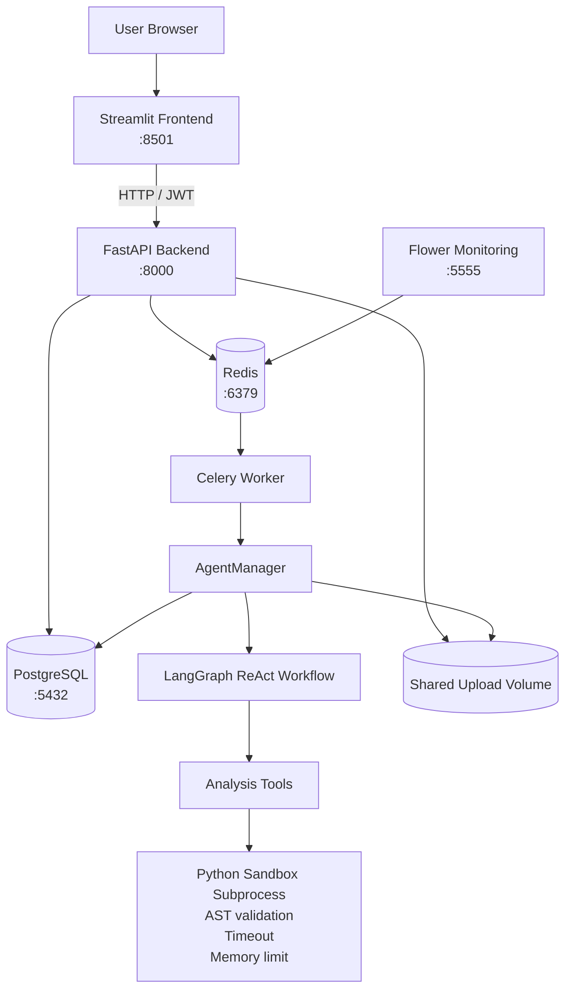

# Target Architecture

## 1. Overview

The modernized Agentic Data Analysis platform separates the original Streamlit proof of concept into independent application components.

The main objectives of the architecture are:

- durable persistence;
- multi-user isolation;
- asynchronous analysis;
- controlled Python execution;
- horizontal scalability;
- observability;
- reproducible deployment.

The application is composed of:

- Streamlit frontend;
- FastAPI backend;
- PostgreSQL;
- Redis;
- Celery worker;
- Flower;
- LangGraph agent;
- isolated Python execution subprocess.

---

## 2. High-Level Architecture



---

## 3. Component Responsibilities

### Streamlit Frontend

Location:

`frontend/`

The frontend is responsible for user interaction.

It provides:

- registration and login;
- session creation and selection;
- dataset upload;
- chat interaction;
- asynchronous task polling;
- persistent chat history;
- Plotly visualization rendering.

The frontend does not directly access PostgreSQL or Redis.

All application data is accessed through FastAPI.

The backend URL is configured through:

`API_BASE_URL`

Inside Docker Compose, the frontend communicates with:

`http://backend:8000`

---

### FastAPI Backend

Location:

`backend/app/main.py`

FastAPI is the stateless HTTP boundary of the application.

Its responsibilities include:

- authentication;
- JWT validation;
- authorization;
- tenant isolation;
- session management;
- message persistence;
- dataset metadata;
- CSV upload;
- visualization persistence;
- Celery task submission;
- Celery task-status retrieval;
- Prometheus metrics;
- health monitoring;
- structured JSON request logging.

Business state is stored outside the FastAPI process.

This allows the backend to be restarted or replicated without losing application state.

---

## 4. Why FastAPI Instead of a Stateful Streamlit Backend?

The original POC mixed presentation, state management and analysis logic inside Streamlit.

That architecture becomes problematic when several users access the application simultaneously.

A dedicated FastAPI backend provides:

- explicit HTTP contracts;
- stateless request handling;
- reusable authentication;
- centralized authorization;
- independent horizontal scaling;
- easier testing;
- separation between frontend and business logic.

Streamlit therefore becomes a client of the backend rather than the location where durable application state lives.

---

## 5. Authentication and Tenant Isolation

Authentication uses JWT access and refresh tokens.

Passwords are never stored in plaintext. They are hashed using bcrypt before persistence.

Protected endpoints use:

`get_current_user`

to retrieve the authenticated user.

Database queries are scoped using the current user's identifier.

A user cannot retrieve another user's:

- sessions;
- messages;
- datasets;
- visualizations;
- agent results.

Cross-user access is covered by automated tenant-isolation tests.

This prevents the multi-user data leak identified in the original POC.

---

## 6. PostgreSQL Persistence

PostgreSQL is the durable source of truth.

The main SQLAlchemy entities are:

- `User`;
- `ChatSession`;
- `Message`;
- `Dataset`;
- `Visualization`.

The database persists:

- accounts;
- analysis sessions;
- chat messages;
- dataset metadata;
- Plotly figures serialized as JSON;
- creation and update timestamps.

Application state therefore survives:

- FastAPI restart;
- Celery restart;
- frontend restart;
- Docker container recreation.

Database schema evolution is managed using Alembic.

At backend startup, migrations are applied before Uvicorn starts:

```bash
alembic upgrade head
```

---

## 7. Dataset Storage

Uploaded CSV files must be accessible both by FastAPI and by the Celery worker.

Docker Compose therefore provides the shared volume:

`uploads_data`

It is mounted at:

`/app/uploads`

for both services.

The flow is:

```text
User
  ↓
Streamlit
  ↓
FastAPI upload
  ↓
uploads_data
  ↓
Celery worker
  ↓
AgentManager
```

The upload location is configured using:

`UPLOAD_ROOT`

The `AgentManager` validates resolved paths against this authorized root before loading a dataset.

This prevents datasets from referencing arbitrary locations on the host filesystem.

---

## 8. Agent Architecture

Agent implementation:

`backend/app/agent/`

Main components:

- `manager.py` — session and dataset orchestration;
- `graph.py` — LangGraph workflow;
- `nodes.py` — workflow nodes;
- `state.py` — graph state;
- `planner.py` — planning strategies;
- `tools.py` — analysis tools;
- `executor.py` — controlled execution interface;
- `sandbox_runner.py` — isolated execution process.

---

## 9. ReAct and LangGraph

The agent follows a ReAct-style cycle:

```text
Reason
  ↓
Choose Action
  ↓
Execute Tool
  ↓
Observe Result
  ↓
Reason Again
  ↓
Final Answer
```

ReAct describes the reasoning pattern.

LangGraph provides the orchestration mechanism used to implement that cycle through:

- state;
- nodes;
- edges;
- conditional transitions;
- tool execution loops.

This separation makes the agent workflow explicit and testable.

---

## 10. Planner Strategy

The project supports a deterministic mock planner for:

- development;
- automated tests;
- demonstrations without external API costs.

The planner mode is configured through:

`AGENT_PLANNER`

Example:

```env
AGENT_PLANNER=mock
```

An LLM-backed planner can optionally be configured using:

```env
AGENT_PLANNER=llm
OPENAI_API_KEY=...
```

The deterministic planner allows the complete LangGraph/tool architecture to be exercised without depending on an external API during tests.

---

## 11. Agent Persistence

Conversation persistence is implemented explicitly through PostgreSQL.

`AgentManager` loads previous messages from the database and persists new messages after each turn.

Visualizations generated during a response are linked to persisted assistant messages.

Therefore the source of truth is not an `AgentManager` Python instance.

A new `AgentManager` can reconstruct the conversation state using persisted database records.

This behavior is covered by persistence tests that:

1. create an agent manager;
2. save conversation data;
3. close the SQLAlchemy session;
4. create a new SQLAlchemy session;
5. create a new `AgentManager`;
6. recover the previous history.

A PostgreSQL LangGraph checkpointer could provide an additional graph-level checkpointing mechanism, but it is optional because the required application-level persistence is already implemented explicitly.

---

## 12. Controlled Python Execution

The original POC used raw Python execution without sufficient isolation.

The modernized architecture introduces several security layers.

### 12.1 AST Validation

Generated Python source code is parsed before execution.

The validator rejects:

- `import`;
- `from ... import ...`;
- `__import__`;
- `open`;
- `exec`;
- `eval`;
- `compile`;
- dangerous introspection helpers;
- dunder names and attributes;
- selected filesystem helpers;
- selected network/external-data helpers;
- dangerous pandas/NumPy file operations.

Examples of rejected operations include:

```python
__import__("os").system("echo HACKED")
```

```python
open("/etc/passwd")
```

```python
pd.read_csv("/etc/passwd")
```

```python
pd.read_csv("https://example.com/data.csv")
```

---

### 12.2 Restricted Execution Environment

Executed code receives only explicitly exposed scientific libraries:

- pandas;
- NumPy;
- SciPy statistics;
- scikit-learn;
- Plotly Express;
- Plotly Graph Objects.

Only a restricted set of builtins is exposed.

---

### 12.3 Subprocess Isolation

Validated code runs inside a separate Python subprocess.

It does not execute directly inside the Celery worker process.

This means a pathological analysis does not permanently block the worker process itself.

---

### 12.4 Timeout

Execution time is bounded through:

`SANDBOX_TIMEOUT_SECONDS`

Default:

```text
10 seconds
```

An infinite loop such as:

```python
while True:
    pass
```

is terminated when the execution timeout is reached.

The timeout mechanism is covered by automated tests.

---

### 12.5 Memory Limit

The sandbox applies a Linux process virtual-memory limit.

Configuration:

`SANDBOX_MEMORY_LIMIT_MB`

Default:

```text
512 MB
```

A lower explicit limit is used during security testing to verify that a deliberately excessive allocation is rejected.

---

### 12.6 Security Boundary

The sandbox significantly improves security compared with raw `exec()`.

It combines:

```text
AST validation
      +
restricted builtins
      +
module whitelist
      +
subprocess isolation
      +
timeout
      +
memory limit
```

However, this should not be described as equivalent to hardened kernel-level sandboxing.

A public service executing fully hostile arbitrary code should additionally use stronger isolation such as:

- dedicated containers;
- namespaces;
- seccomp;
- AppArmor;
- network isolation;
- CPU quotas;
- stricter filesystem isolation.

---

## 13. Celery and Redis

Potentially long-running analysis is removed from the synchronous HTTP request lifecycle.

The FastAPI backend submits analysis work to Celery.

Redis is used as:

- Celery broker;
- Celery result backend.

The API returns a task identifier.

The frontend then polls the backend for task completion.

This prevents analysis workloads from blocking FastAPI request workers.

---

## 14. Queue Separation

The Celery configuration defines two logical queues:

### `default`

Used for lightweight/system tasks such as:

`health.ping`

### `analysis`

Used for:

`agent.run_turn`

The worker currently consumes both:

```text
analysis,default
```

but the logical separation makes independent scaling possible.

For example, a production deployment could dedicate additional workers to:

```bash
--queues=analysis
```

without increasing lightweight system workers.

---

## 15. Flower Monitoring

Flower runs as an independent lightweight service.

Port:

`5555`

Flower provides visibility into:

- Celery workers;
- tasks;
- queues;
- task states;
- execution activity.

It connects to Redis and does not participate directly in end-user HTTP requests.

For a public production deployment, Flower should be protected through:

- authentication;
- reverse-proxy authorization;
- VPN;
- private network access.

---

## 16. Observability

### Structured JSON Logs

The backend uses `structlog`.

Application request logs are emitted as JSON.

Example:

```json
{
  "method": "GET",
  "path": "/health",
  "status_code": 200,
  "duration_ms": 1.21,
  "event": "request_completed",
  "request_id": "06df673e-cf28-4966-b065-9ddda73502a9",
  "timestamp": "2026-08-29T16:00:35.784249Z",
  "level": "info"
}
```

Each request receives a unique `request_id`.

The identifier is:

- included in structured logs;
- returned in the `X-Request-ID` response header;
- included in generic internal-error responses.

Detailed exceptions remain in server logs instead of being exposed to clients.

---

## 17. Prometheus Metrics

FastAPI exposes:

`GET /metrics`

Metrics include:

- total HTTP requests;
- HTTP request latency.

Route templates are used when possible as Prometheus labels instead of concrete resource IDs.

For example:

```text
/sessions/{session_id}
```

is preferable to creating independent labels for:

```text
/sessions/1
/sessions/2
/sessions/3
...
```

This reduces metric cardinality at scale.

---

## 18. Global Error Handling

FastAPI includes a global exception handler.

Unexpected errors:

- are logged with structured contextual data;
- retain the request identifier;
- do not expose internal stack traces to users.

The client receives a generic response such as:

```json
{
  "detail": "Internal server error",
  "request_id": "..."
}
```

This makes errors traceable without leaking implementation details.

---

## 19. CORS

CORS is configured explicitly for the Streamlit development origins.

Examples:

```text
http://localhost:8501
http://127.0.0.1:8501
```

The API deliberately avoids an unrestricted production configuration such as:

```python
allow_origins=["*"]
```

when credentials are involved.

Explicit origins reduce accidental cross-origin exposure.

---

## 20. Health Checks

Docker Compose defines health checks for:

- PostgreSQL;
- Redis;
- FastAPI;
- Streamlit;
- Celery worker;
- Flower.

FastAPI exposes:

`GET /health`

The Celery worker is validated using:

```bash
celery inspect ping
```

Service dependencies use health status where appropriate before dependent containers are started.

---

## 21. Docker Deployment

The final Docker Compose architecture contains:

| Service | Port |
|---|---:|
| PostgreSQL | 5432 |
| Redis | 6379 |
| FastAPI | 8000 |
| Streamlit | 8501 |
| Flower | 5555 |
| Celery Worker | internal |

Docker volumes:

- `postgres_data`;
- `uploads_data`.

`postgres_data` stores durable database state.

`uploads_data` allows FastAPI and Celery to share uploaded CSV files.

---

## 22. Container Persistence

Containers themselves are disposable.

The following command can stop and recreate the stack:

```bash
docker compose down
docker compose up -d
```

without losing persisted:

- users;
- sessions;
- messages;
- visualizations;
- dataset uploads.

Persistent state is stored in Docker volumes rather than container-local writable layers.

Using:

```bash
docker compose down -v
```

would intentionally remove these volumes and therefore should not be used when persistence must be preserved.

---

## 23. Scalability

The architecture removes the main scalability limitations of the original POC.

### FastAPI

The API does not depend on in-process conversation state.

Several API instances can therefore share the same PostgreSQL and Redis services.

### Celery

Analysis workers are independent of HTTP workers.

Additional workers can be added when analysis demand increases.

### PostgreSQL

PostgreSQL centralizes durable application state.

### Redis

Redis decouples task submission from task execution.

### Streamlit

Streamlit acts as an API client instead of containing the application's durable business state.

---

## 24. Original Risks and Mitigations

| Original Risk | Root Cause | Modernized Solution |
|---|---|---|
| Reboot amnesia | In-memory/session-only state | PostgreSQL messages and sessions |
| Multi-user data leak | No authentication or tenant scoping | JWT + user-scoped queries |
| Visualization volatility | Figures stored only in memory | Plotly JSON persisted in PostgreSQL |
| Scalability bottleneck | Monolithic synchronous Streamlit | FastAPI + Redis + Celery |
| Unsafe code execution | Raw `exec()` | AST validation + isolated subprocess + timeout + memory limit |

---

## 25. Testing Strategy

The automated test suite covers:

- authentication;
- authorization;
- unauthorized access;
- tenant isolation;
- SQL injection resistance;
- dataset upload;
- session persistence;
- visualization persistence;
- agent integration;
- LangGraph tool execution;
- histogram generation;
- scatter-plot generation;
- statistical analysis;
- malicious code rejection;
- infinite-loop timeout;
- memory limits;
- secret handling.

Current test status:

```text
21 passed
```

Current backend coverage:

```text
83%
```

This exceeds the examination requirement of 70%.

---

## 26. Architectural Trade-Offs

Several trade-offs remain explicit.

### LangGraph Checkpointer

A PostgreSQL LangGraph checkpointer is not required for application persistence because messages, sessions and visualizations are explicitly persisted in PostgreSQL.

It remains a possible future enhancement for graph-level execution checkpointing.

### Refresh Tokens

Refresh tokens are JWT-based.

A larger production system could persist refresh-token identifiers server-side to support:

- explicit revocation;
- reuse detection;
- session management.

### Streamlit Cookies

The frontend uses encrypted cookie storage appropriate for the project.

A conventional browser SPA or server-rendered application would generally prefer server-issued:

- Secure;
- HttpOnly;
- SameSite

cookies for refresh-token handling.

### Python Sandbox

The execution layer is significantly safer than the original POC but is not presented as a perfect hostile-code sandbox.

Additional kernel/container isolation would be appropriate for unrestricted public arbitrary-code execution.

### Planner

The deterministic mock planner makes the complete architecture testable without external API costs.

A production deployment can replace it with an LLM-backed planner without changing the surrounding:

- LangGraph;
- tools;
- AgentManager;
- Celery;
- persistence architecture.

---

## 27. Final Architecture Summary

The modernized platform follows the principle that application processes should be replaceable while durable state remains external.

The final flow is:

```text
User
  ↓
Streamlit :8501
  ↓
FastAPI :8000
  ├────────────→ PostgreSQL :5432
  │               users
  │               sessions
  │               messages
  │               datasets
  │               visualizations
  │
  ├────────────→ uploads_data
  │
  └────────────→ Redis :6379
                    ↓
               Celery Worker
                    ↓
               AgentManager
                    ↓
                LangGraph
                    ↓
              Analysis Tools
                    ↓
          Isolated Python Sandbox
          AST + timeout + RAM limit

Flower :5555
    ↓
Celery / Redis monitoring
```

This architecture directly addresses the five critical production risks identified during the initial POC analysis.