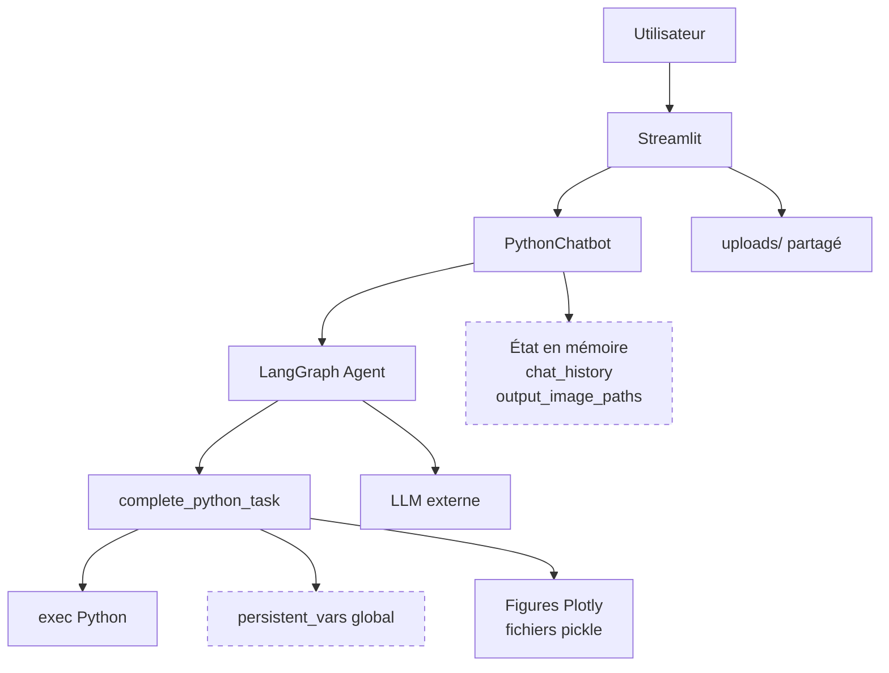
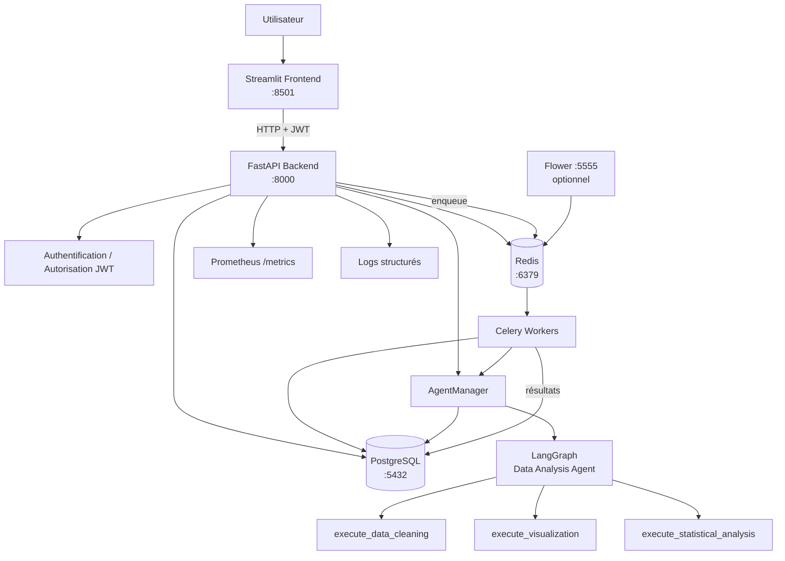

# Analyse d'architecture du POC Agentic Data Analysis

## 1. Résumé exécutif

Le Proof of Concept actuel permet de réaliser des analyses de données à l'aide
d'un agent LangGraph et d'outils Python, mais son architecture n'est pas adaptée
à une utilisation SaaS multi-utilisateurs en production.

Les tests réalisés sur le POC ont mis en évidence cinq risques principaux :

1. perte de l'historique et de l'état lors d'un redémarrage ;
2. absence d'isolation des données entre utilisateurs ;
3. possibilité d'exécuter du code Python arbitraire ;
4. impossibilité de scaler horizontalement de manière fiable ;
5. perte du lien entre les messages et les visualisations après redémarrage.

Ces problèmes proviennent principalement du stockage de l'état dans la mémoire
du processus Python et dans un système de fichiers partagé, de l'absence
d'authentification et de persistance en base de données, ainsi que de
l'utilisation directe de `exec()`.

L'architecture cible devra rendre le backend aussi stateless que possible,
externaliser l'état durable dans PostgreSQL, authentifier les utilisateurs,
isoler les ressources par utilisateur et session, et utiliser Redis/Celery pour
les traitements longs ou coûteux.


## 2. Problèmes identifiés

### 2.1 Amnésie au redémarrage

#### Découverte

Un test a été réalisé en créant une instance de `PythonChatbot`, puis en ajoutant
un message dans son historique.

Avant redémarrage :

```text
Historique avant redémarrage : 1
Mon dataset est clients_test.csv
```

Une nouvelle instance a ensuite été créée dans un nouveau processus Python afin
de simuler un redémarrage de l'application.

Après redémarrage :

```text
Historique après redémarrage : 0
[]
```

Le contexte de conversation est donc perdu lorsque le processus est recréé.

#### Cause racine

Dans `Pages/backend.py`, plusieurs informations sont conservées uniquement dans
l'objet Python :

```python
self.chat_history = []
self.intermediate_outputs = []
self.output_image_paths = {}
```

Ces structures sont initialisées par `reset_chat()` et aucune base de données
ni mécanisme de checkpoint persistant n'est utilisé.

Le chatbot est également conservé dans la session Streamlit, ce qui ne fournit
pas une persistance durable côté serveur.

#### Impact métier

Un redémarrage provoqué par un déploiement, une panne ou un changement
d'instance entraîne la disparition de la conversation.

Pour un utilisateur, cela signifie :

- perte du contexte d'analyse ;
- nécessité de répéter certaines demandes ;
- recalculs inutiles ;
- consommation supplémentaire de ressources et de tokens LLM ;
- diminution de la fiabilité perçue du service.

#### Solution proposée

Les sessions et les messages doivent être persistés dans PostgreSQL.

Chaque conversation devra être associée à un `user_id` et un `session_id`.
L'état LangGraph pourra également être persisté à l'aide d'un checkpointer
PostgreSQL.

La RAM du backend ne devra pas être considérée comme la source de vérité.


### 2.2 Absence d'isolation multi-utilisateurs

#### Découverte

Un fichier nommé `confidentiel_user_A.csv` a été uploadé depuis une première
session navigateur.

Une seconde session indépendante, ouverte en navigation privée, pouvait voir ce
même fichier sans l'avoir uploadé.

Le fichier était donc directement visible par un autre utilisateur potentiel.

#### Cause racine

Les fichiers sont stockés dans un répertoire commun :

```text
uploads/
```

L'application récupère les fichiers disponibles en parcourant directement ce
répertoire.

Aucune authentification n'existe et les datasets ne possèdent aucun propriétaire
identifié par un `user_id`.

Un autre risque existe également dans `Pages/graph/tools.py` :

```python
persistent_vars = {}
```

Cette variable est globale au processus Python et n'est pas isolée par
utilisateur ou par session.

#### Impact métier

Dans une application SaaS, cette architecture peut provoquer une fuite de
données entre clients.

Elle présente notamment :

- un risque de divulgation de données personnelles ;
- un risque de divulgation de données métier confidentielles ;
- un problème potentiel de conformité RGPD ;
- une impossibilité de garantir l'isolation entre tenants.

#### Solution proposée

Le nouveau système devra introduire une authentification JWT.

Chaque ressource persistante devra posséder un propriétaire, par exemple :

```text
Dataset.user_id
Session.user_id
```

Toutes les requêtes devront ensuite vérifier l'appartenance de la ressource à
l'utilisateur authentifié.

L'authentification seule ne suffit donc pas : le backend devra également
effectuer des contrôles d'autorisation sur chaque ressource.


### 2.3 Exécution de code Python non sécurisée

#### Découverte

Un test non destructif a été réalisé directement sur l'outil Python avec le
code suivant :

```python
__import__('os').system('echo HACKED')
```

Le processus a affiché :

```text
HACKED
```

Le code exécuté par l'agent peut donc accéder au système d'exploitation.

#### Cause racine

L'outil d'analyse utilise directement :

```python
exec(python_code, exec_globals)
```

L'environnement utilisé pour `exec()` contient notamment une copie des globals
du processus :

```python
exec_globals = globals().copy()
```

Il n'existe pas de sandbox réelle, de contrôle strict des imports, de limite de
temps ou de limite de ressources.

#### Impact métier

Un code malveillant ou incorrect pourrait potentiellement :

- lire des fichiers du serveur ;
- accéder à des variables d'environnement ;
- modifier ou supprimer des fichiers ;
- lancer des commandes système ;
- consommer de manière excessive le CPU ou la mémoire ;
- exfiltrer des informations si le réseau est accessible.

Cette vulnérabilité est particulièrement critique dans un service
multi-utilisateurs.

#### Solution proposée

Pour l'examen, l'exécution pourra rester basée sur `exec()`, mais avec un
environnement explicitement contrôlé et une whitelist de bibliothèques
autorisées.

Les globals exposés doivent être minimisés et les imports arbitraires bloqués.

Les traitements devront également être déplacés vers des workers Celery afin de
ne pas exécuter les analyses longues dans le processus FastAPI.

Dans une architecture de production réelle, une isolation plus forte par
processus ou conteneur, avec limitations CPU, mémoire, filesystem et réseau,
serait préférable.


### 2.4 Limites de scalabilité

#### Découverte

Deux instances indépendantes de `PythonChatbot` ont été créées.

Un message a été ajouté uniquement à la première instance.

Résultat :

```text
Instance A : 1
Instance B : 0
```

Les deux instances ne partagent donc pas leur état.

#### Cause racine

L'historique et les variables de travail sont stockés en mémoire dans chaque
processus Python.

Ainsi, avec plusieurs replicas du backend :

```text
Instance A -> mémoire A
Instance B -> mémoire B
```

Une requête arrivant sur une autre instance ne retrouvera pas nécessairement
l'état de la requête précédente.

De plus, l'analyse est actuellement exécutée de manière synchrone via
`graph.invoke()`. Il n'existe pas de file de tâches permettant de répartir les
analyses longues entre plusieurs workers.

#### Impact métier

Cette architecture limite fortement la capacité à supporter plusieurs centaines
d'utilisateurs.

Une augmentation du trafic pourrait provoquer :

- saturation d'une instance ;
- augmentation de la latence ;
- perte de contexte lors d'un changement d'instance ;
- blocage des requêtes pendant les analyses longues ;
- difficulté à ajouter plusieurs replicas derrière un load balancer.

#### Solution proposée

L'état durable doit être externalisé dans PostgreSQL afin que plusieurs
instances du backend puissent accéder aux mêmes sessions.

Le backend FastAPI doit éviter de conserver en RAM les informations nécessaires
à la continuité d'une session.

Redis et Celery permettront de mettre en file d'attente les traitements longs
et de répartir leur exécution entre plusieurs workers.

Cette architecture permettra de scaler séparément :

```text
Backend API
Celery Workers
PostgreSQL
Redis
Frontend
```


### 2.5 Volatilité des visualisations

#### Découverte

Une figure Plotly a été générée directement avec l'outil Python.

Un fichier correspondant a bien été créé dans :

```text
images/plotly_figures/pickle/
```

Après création d'une nouvelle instance du chatbot, simulant un redémarrage,
le mapping permettant d'associer les visualisations aux réponses était vide :

```text
Mapping des visualisations après redémarrage :
{}
```

Le fichier de la figure existait pourtant toujours sur le disque.

#### Cause racine

Les fichiers de visualisation sont écrits sur le filesystem, mais leur
association avec les messages est conservée en mémoire dans :

```python
self.output_image_paths = {}
```

Le système possède donc deux sources d'état différentes :

```text
RAM        -> relation message / visualisation
Filesystem -> fichier de visualisation
```

Si le processus redémarre, le fichier peut survivre alors que la relation
nécessaire pour le retrouver disparaît.

#### Impact métier

Un utilisateur peut retrouver une conversation sans pouvoir retrouver les
visualisations qui avaient été produites.

Cela peut provoquer :

- perte de résultats d'analyse ;
- incohérence entre historique et visualisations ;
- nécessité de recalculer les graphiques ;
- expérience utilisateur imprévisible.

#### Solution proposée

Les visualisations devront être persistées avec les messages auxquels elles
appartiennent.

Une figure Plotly peut être sérialisée en JSON et stockée avec une référence au
`message_id` ou au `session_id`.

Par exemple :

```text
Message
├── id
├── session_id
├── role
├── content
└── figure_json
```

Le JSON Plotly est également préférable au format `pickle` pour les échanges
entre composants.

Les fichiers pickle provenant d'une source non fiable ne doivent jamais être
désérialisés, car le format pickle peut lui-même permettre l'exécution de code.

## 3. Architecture actuelle

L'architecture du POC est principalement monolithique. Streamlit gère à la fois
l'interface utilisateur et la création de l'agent. L'état des conversations est
conservé dans le processus Python et les datasets ainsi que les visualisations
sont stockés sur le filesystem local.



Cette architecture est adaptée à un Proof of Concept, mais plusieurs composants
dépendent directement de la mémoire ou du disque local d'une instance.

Une seconde instance de l'application ne possède donc pas nécessairement le
même état que la première.


## 4. Architecture cible

L'architecture cible sépare l'interface, l'API, la persistance et les traitements
asynchrones.



### Flux principal

1. L'utilisateur s'authentifie depuis Streamlit.
2. FastAPI valide son JWT.
3. Les sessions et datasets accessibles sont filtrés selon son `user_id`.
4. L'AgentManager recharge l'état persistant nécessaire depuis PostgreSQL.
5. LangGraph raisonne et choisit l'outil approprié.
6. Une analyse longue peut être envoyée à Celery via Redis.
7. Les résultats, messages et visualisations sérialisées sont persistés.
8. Le frontend peut reconstruire une session même après un redémarrage du
   backend.

L'objectif est que les instances FastAPI soient interchangeables : aucune
information critique ne doit dépendre uniquement de la RAM d'une instance.


## 5. Décisions techniques

### 5.1 FastAPI comme backend

Le POC utilise actuellement Streamlit comme interface et comme point central de
la logique applicative.

FastAPI sera introduit afin de séparer clairement :

- l'interface utilisateur ;
- la logique métier ;
- l'authentification ;
- l'accès aux données ;
- l'exécution des agents.

Cette séparation facilite les tests, le déploiement et le scaling indépendant
du frontend et du backend.

FastAPI fournit également nativement une documentation OpenAPI, accessible
notamment via `/docs`.


### 5.2 PostgreSQL comme source de vérité

La mémoire du processus Python ne peut pas être considérée comme un stockage
durable.

PostgreSQL sera utilisé pour conserver notamment :

- les utilisateurs ;
- les sessions ;
- les messages ;
- les métadonnées des datasets ;
- les résultats d'analyse ;
- les visualisations sérialisées.

Cela permet à plusieurs instances FastAPI ou Celery de partager le même état.

Les évolutions du schéma seront gérées par Alembic afin de disposer de
migrations reproductibles.


### 5.3 Authentification JWT et autorisation

Le système cible utilisera des tokens JWT pour identifier les utilisateurs.

Les mots de passe ne seront jamais stockés en clair mais sous forme de hash
adaptatif, par exemple avec bcrypt.

Cependant, l'authentification seule ne garantit pas l'isolation.

Chaque accès à une ressource devra également appliquer une règle
d'autorisation du type :

```text
resource.user_id == current_user.id
```

Cela permettra d'éviter qu'un utilisateur authentifié puisse accéder aux
sessions ou datasets d'un autre utilisateur.


### 5.4 Redis et Celery

Les analyses peuvent être longues et coûteuses.

Les exécuter directement dans une requête HTTP risquerait de bloquer le backend
et d'augmenter fortement les temps de réponse.

Redis servira de broker de messages et Celery exécutera les tâches longues dans
des workers séparés.

Le backend pourra ainsi accepter une requête, créer une tâche puis rester
disponible pour les autres utilisateurs.

Il est important de distinguer les rôles :

```text
PostgreSQL = état durable / source de vérité
Redis      = transport et file de tâches
Celery     = exécution asynchrone des tâches
```

Les gros DataFrames ne devront idéalement pas être transmis directement dans
Redis. Une tâche Celery recevra plutôt des identifiants permettant de recharger
les données depuis un stockage durable.


### 5.5 Sécurisation de l'exécution Python

Le POC exécute actuellement du code avec :

```python
exec(python_code, exec_globals)
```

Pour répondre aux attentes de l'examen, `exec()` peut être conservé mais son
environnement doit être fortement contrôlé.

Les bibliothèques autorisées seront limitées à celles nécessaires à l'analyse,
par exemple :

```text
pandas
numpy
plotly.express
plotly.graph_objects
scipy.stats
scikit-learn
```

Les imports arbitraires et l'accès direct à des modules tels que `os`,
`subprocess` ou `sys` devront être bloqués.

Le passage vers Celery permet d'isoler l'exécution du processus FastAPI, mais
Celery ne constitue pas à lui seul une sandbox de sécurité.

Dans un véritable environnement de production, l'exécution de code généré
devrait idéalement être isolée dans un processus ou un conteneur dédié avec des
limites CPU, mémoire, filesystem, réseau et temps d'exécution.


### 5.6 Persistance des visualisations

Les figures Plotly ne seront plus reliées aux messages par un dictionnaire
stocké uniquement en mémoire.

Elles seront sérialisées en JSON puis associées à leur session ou message en
base de données.

Cela permet :

- de restaurer une visualisation après redémarrage ;
- de l'afficher depuis n'importe quelle instance backend ;
- d'éviter de dépendre de chemins de fichiers locaux ;
- de faciliter les échanges entre frontend et backend.

Le format `pickle` ne sera pas utilisé comme format d'échange avec des données
non fiables.


### 5.7 Observabilité

Le backend devra fournir au minimum :

```text
/health
/metrics
```

Les logs devront être structurés et chaque requête posséder un identifiant
permettant de corréler les événements entre composants.

Les métriques Prometheus permettront notamment de suivre :

- latence ;
- trafic ;
- erreurs ;
- saturation.

Ces métriques correspondent aux Four Golden Signals utilisés pour superviser
les services en production.


## 6. Roadmap de modernisation

La migration sera réalisée progressivement afin de réduire le risque de
régression.

### Étape 1 — Audit du POC

- reproduire les problèmes existants ;
- identifier leurs causes racines ;
- documenter l'architecture actuelle ;
- définir l'architecture cible.

### Étape 2 — Fondation FastAPI

- créer le backend FastAPI ;
- ajouter `/health` ;
- ajouter `/metrics` ;
- configurer CORS ;
- ajouter le middleware Request ID ;
- ajouter les logs structurés ;
- mettre en place la gestion globale des exceptions.

### Étape 3 — PostgreSQL

- créer les modèles SQLAlchemy ;
- configurer PostgreSQL ;
- mettre en place Alembic ;
- créer les tables utilisateurs, sessions et messages ;
- ajouter les indexes nécessaires.

### Étape 4 — Authentification et isolation

- inscription utilisateur ;
- hash des mots de passe ;
- connexion ;
- création et validation des JWT ;
- dépendance `get_current_user` ;
- filtrage systématique des ressources par propriétaire.

### Étape 5 — Persistance des sessions

- créer et lister les sessions ;
- restaurer une conversation ;
- sauvegarder les messages ;
- associer datasets et visualisations aux sessions.

### Étape 6 — Modernisation de l'agent

Remplacer l'outil Python générique par plusieurs outils spécialisés :

```text
execute_data_cleaning
execute_visualization
execute_statistical_analysis
```

L'AgentManager sera responsable :

- du contexte DataFrame ;
- des variables persistantes pendant une analyse ;
- de la capture de stdout ;
- de la persistance de l'historique ;
- de la sérialisation des figures Plotly.

### Étape 7 — Sécurisation de l'exécution

- whitelist des bibliothèques ;
- environnement `exec()` minimal ;
- blocage des imports dangereux ;
- tests de code malveillant ;
- limitation du temps et des ressources si possible.

### Étape 8 — Traitements asynchrones

- ajouter Redis ;
- ajouter Celery ;
- déplacer les analyses longues vers les workers ;
- ajouter Flower si nécessaire pour l'observation des tâches.

### Étape 9 — Migration du frontend

Streamlit ne communiquera plus directement avec un objet Python local.

Il utilisera l'API FastAPI pour :

- s'authentifier ;
- créer une session ;
- sélectionner une session ;
- envoyer un message ;
- récupérer l'historique ;
- récupérer les visualisations.

### Étape 10 — Conteneurisation

Créer les services Docker nécessaires :

```text
frontend
backend
postgres
redis
celery
flower (optionnel)
```

Ajouter :

- health checks ;
- volumes persistants ;
- variables d'environnement ;
- `.env.example` sans secrets.

### Étape 11 — Tests et validation

Ajouter progressivement :

- tests unitaires ;
- tests API ;
- tests d'authentification ;
- tests d'isolation multi-utilisateurs ;
- tests de persistance ;
- tests de sécurité ;
- tests d'intégration de l'agent.

L'objectif minimal sera une couverture backend de 70 %.

### Étape 12 — Documentation et validation finale

Créer et finaliser :

```text
docs/ARCHITECTURE_ANALYSIS.md
docs/SETUP.md
docs/API.md
README.md
```

Puis valider les scénarios critiques :

```text
Utilisateur -> register/login -> JWT valide

Utilisateur A -> session A
Utilisateur B -X-> session A

Conversation -> restart backend -> conversation restaurée

Visualisation -> restart backend -> visualisation restaurée

Code malveillant -> __import__('os') -> refusé

Analyse longue -> Celery -> API reste disponible

docker compose up -> tous les services deviennent healthy
```


## 7. Conclusion

Le principal changement architectural consiste à passer d'un POC stateful,
centré sur un unique processus Python, à une plateforme dont l'état durable est
externalisé.

La cible peut être résumée ainsi :

```text
POC
État dans le processus
        ↓
Architecture cible
État dans PostgreSQL + traitements distribués
```

FastAPI devient la couche applicative, PostgreSQL la source de vérité,
Redis/Celery la couche de traitement asynchrone et Streamlit un client du
backend.

Cette séparation doit permettre d'améliorer simultanément la sécurité,
l'isolation multi-utilisateurs, la résilience et la scalabilité de la
plateforme.


