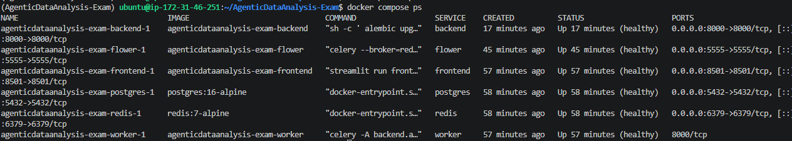
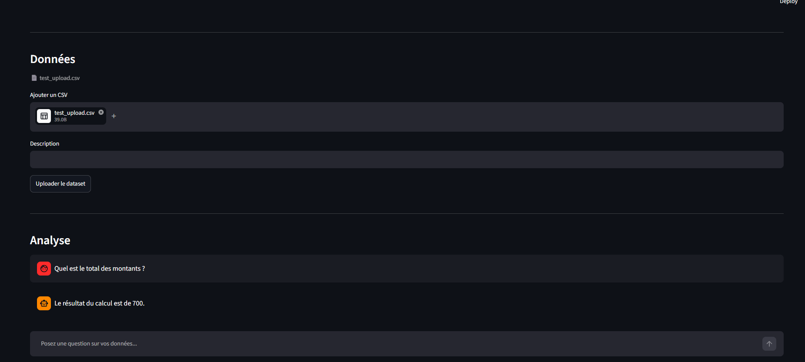
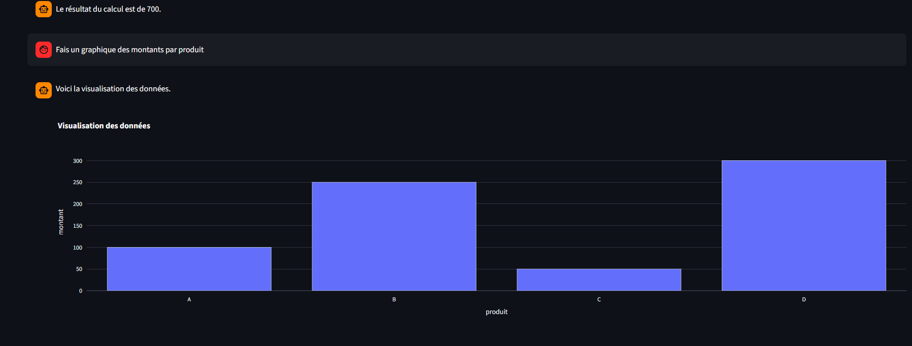
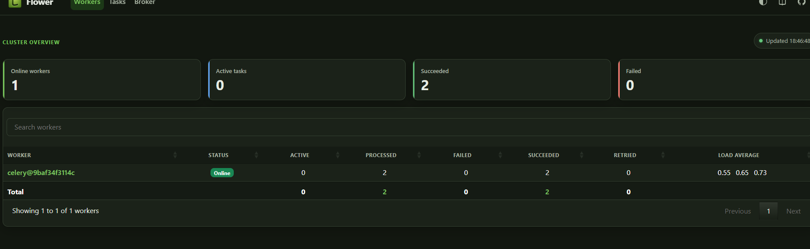
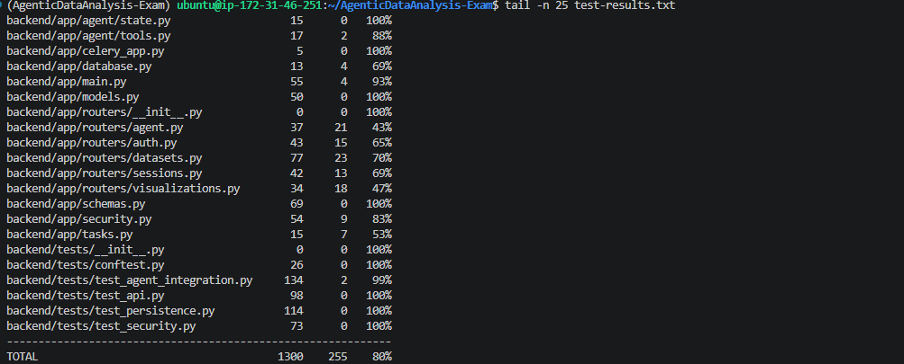

# Proof of Deployment

## Agentic Data Analysis - Modernization Exam

This document provides deployment evidence for the modernized Agentic Data Analysis platform.

The platform is deployed using Docker Compose and includes:

- PostgreSQL;
- Redis;
- FastAPI;
- Streamlit;
- Celery worker;
- Flower.

Automated backend tests are executed inside the Docker environment.

---

## 1. Docker Compose Services

The complete platform is started with:

```bash
docker compose up -d
```

Service status is verified with:

```bash
docker compose ps
```

All six required services are running and healthy:

- PostgreSQL;
- Redis;
- FastAPI backend;
- Streamlit frontend;
- Celery worker;
- Flower.



### Exposed Ports

| Service | Port |
|---|---:|
| PostgreSQL | 5432 |
| Redis | 6379 |
| FastAPI | 8000 |
| Streamlit | 8501 |
| Flower | 5555 |

The Celery worker runs internally and does not require a public port.

---

## 2. End-to-End Application

The Streamlit frontend communicates with the FastAPI backend.

A user can:

1. register and authenticate;
2. create an analysis session;
3. upload a CSV dataset;
4. submit an analysis request;
5. receive an asynchronous result generated through Celery and LangGraph;
6. recover previous messages after refresh or restart.

The following screenshot demonstrates a working analysis session.



The analysis request follows the architecture:

```text
Streamlit
    ↓
FastAPI
    ↓
Redis / Celery
    ↓
AgentManager
    ↓
LangGraph
    ↓
Analysis tools
    ↓
Controlled Python execution
```

---

## 3. Persistent Visualization

Visualizations generated by the agent are serialized as Plotly JSON and persisted in PostgreSQL.

They therefore survive browser refreshes and backend/container restarts.

The following screenshot demonstrates a generated visualization.



This addresses the visualization volatility problem identified in the original proof of concept.

---

## 4. Celery and Flower

Long-running analysis does not execute directly inside the FastAPI HTTP request.

FastAPI submits work to Celery through Redis.

The project defines two queues:

```text
default
analysis
```

Agent work is routed to:

```text
analysis
```

while lightweight infrastructure tasks can use:

```text
default
```

Flower provides operational visibility into the Celery infrastructure.



The Celery worker is also protected by a Docker health check using Celery's inspect/ping mechanism.

---

## 5. Backend Health

FastAPI exposes:

```text
GET /health
```

Example verification:

```bash
curl http://127.0.0.1:8000/health
```

Expected response:

```json
{
  "status": "ok",
  "service": "backend"
}
```

The backend container is marked healthy by Docker Compose.

---

## 6. Structured Logging

The backend uses `structlog` and emits application logs as structured JSON.

Example:

```json
{
  "method": "GET",
  "path": "/health",
  "status_code": 200,
  "duration_ms": 1.21,
  "event": "request_completed",
  "request_id": "06df673e-cf28-4966-b065-9ddda73502a9",
  "timestamp": "2026-08-29T16:00:35.784249Z",
  "level": "info"
}
```

Each request receives a unique request ID.

This makes requests traceable across application logs without exposing internal stack traces to clients.

---

## 7. Prometheus Metrics

FastAPI exposes Prometheus-compatible metrics at:

```text
GET /metrics
```

The application records:

- total HTTP requests;
- HTTP request duration.

These metrics provide a foundation for production monitoring and alerting.

---

## 8. Automated Tests in Docker

The backend test suite is executed inside the Docker container using:

```bash
docker compose exec -T backend \
  python -m pytest backend/tests/ -v \
  --cov=backend \
  --cov-report=term
```

Final validated result:

```text
21 passed
```

Backend coverage:

```text
80%
```

The examination requirement is:

```text
>= 70%
```

The final result therefore exceeds the required coverage threshold.



The complete textual test output is included in:

```text
test-results.txt
```

---

## 9. Security Validation

The automated test suite validates several important security properties.

These include:

- authentication;
- unauthorized-access rejection;
- tenant isolation;
- SQL injection resistance;
- filesystem access blocking;
- dangerous import rejection;
- network/external-data helper rejection;
- execution timeout;
- excessive memory allocation rejection;
- secret-management checks.

Generated Python code is not executed directly inside FastAPI.

The execution path uses:

```text
AST validation
    ↓
restricted builtins
    ↓
subprocess isolation
    ↓
timeout
    ↓
memory limit
```

---

## 10. Persistence Validation

Persistent state is stored outside application containers.

PostgreSQL stores:

- users;
- sessions;
- messages;
- dataset metadata;
- visualizations.

Docker volumes store:

```text
postgres_data
uploads_data
```

The `uploads_data` volume is shared between FastAPI and the Celery worker.

The platform was validated after container restart using:

```bash
docker compose down
docker compose up -d
```

User sessions, messages, datasets and visualizations remained available after restart.

---

## 11. Final Deployment Status

The final deployment satisfies the required operational checks:

| Requirement | Result |
|---|---|
| PostgreSQL running | PASS |
| Redis running | PASS |
| FastAPI running | PASS |
| Streamlit running | PASS |
| Celery worker running | PASS |
| Flower running | PASS |
| Docker health checks | PASS |
| Persistent PostgreSQL data | PASS |
| Persistent uploaded datasets | PASS |
| Multi-user isolation | PASS |
| Asynchronous agent execution | PASS |
| Controlled code execution | PASS |
| Structured JSON logs | PASS |
| Prometheus metrics | PASS |
| Backend automated tests | 21 PASS |
| Backend coverage >= 70% | PASS - 80% |

The final application code is available on the `main` branch of the submitted repository.